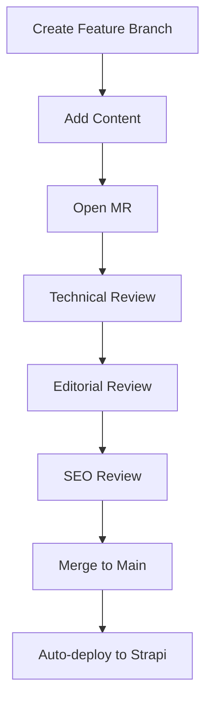

# Strapi Blog Platform on Kubernetes

This repository contains all the Kubernetes YAML files and configurations needed to deploy a complete blog platform using Strapi CMS, Next.js frontend, and PostgreSQL database on Kubernetes.

## 📖 Tutorial Series

This repository accompanies a 3-part tutorial series:

1. **Part 1**: Deploying Strapi CMS and PostgreSQL Database
2. **Part 2**: Adding Next.js Frontend with Ingress Routing  
3. **Part 3**: Production Hardening with Security, HTTPS, and Scaling

## 🗂️ Repository Structure

```
├── strapi-part-1/           # Part 1: Basic Strapi + PostgreSQL deployment
│   ├── postgres-pvc.yaml
│   ├── postgres-deployment.yaml
│   ├── postgres-service.yaml
│   ├── strapi-deployment.yaml
│   ├── strapi-service.yaml
│   ├── strapi-ingress.yaml
│   └── README.md
├── strapi-part-2/           # Part 2: Next.js frontend integration
│   ├── blog-frontend-deployment.yaml
│   ├── blog-frontend-service.yaml
│   ├── blog-ingress.yaml
│   ├── Dockerfile
│   └── README.md
└── strapi-part-3/           # Part 3: Production readiness & security
    ├── strapi-configmap.yaml
    ├── strapi-secret.yaml
    ├── letsencrypt-clusterissuer.yaml
    ├── blog-ingress-tls.yaml
    ├── strapi-uploads-pvc.yaml
    ├── strapi-deployment-production.yaml
    ├── blog-frontend-deployment-production.yaml
    ├── strapi-hpa.yaml
    ├── blog-frontend-hpa.yaml
    ├── postgres-backup-pvc.yaml
    ├── postgres-backup-cronjob.yaml
    ├── network-policies.yaml
    └── README.md
```

## 🚀 Quick Start

### Prerequisites

- Kubernetes cluster (local or cloud)
- kubectl configured
- Ingress controller installed (nginx recommended)
- For Part 3: cert-manager installed and a domain name

### Deployment Options

#### Option 1: Follow Step by Step
1. Start with `strapi-part-1/` - Deploy the basic CMS
2. Continue with `strapi-part-2/` - Add the frontend
3. Finish with `strapi-part-3/` - Production hardening

#### Option 2: Deploy Complete Stack
```bash
# Clone this repository
git clone <your-repo-url>
cd strapi-blog-kubernetes

# Deploy everything (requires updating configurations)
kubectl apply -f strapi-part-1/
kubectl apply -f strapi-part-2/
kubectl apply -f strapi-part-3/
```

## 🛠️ What You'll Build

### Architecture Overview
```
Internet → Ingress → Next.js Frontend
                  → Strapi CMS → PostgreSQL
```

### Components
- **Strapi CMS**: Headless content management system
- **Next.js Frontend**: React-based blog frontend  
- **PostgreSQL**: Database for content storage
- **Ingress**: HTTP/HTTPS routing and load balancing
- **cert-manager**: Automated SSL certificate management

### Production Features (Part 3)
- ✅ HTTPS with Let's Encrypt certificates
- ✅ Horizontal Pod Autoscaling
- ✅ Persistent storage for uploads
- ✅ Automated database backups
- ✅ Network security policies
- ✅ Resource limits and health checks
- ✅ ConfigMaps and Secrets for configuration

## 📋 Configuration Required

Before deployment, update these values:

### Part 2
- Update Docker image names in deployment files
- Build and push your Next.js application image

### Part 3  
- Replace `your-domain.com` with your actual domain
- Replace `your-email@example.com` with your email for Let's Encrypt
- Update image references to your registry

## 🔍 Verification

After deployment, verify everything is working:

```bash
# Check all pods are running
kubectl get pods

# Check services
kubectl get services  

# Check ingress
kubectl get ingress

# Check certificates (Part 3)
kubectl get certificate
```

## 🌐 Access Your Blog

- **Blog Frontend**: `http(s)://your-domain/`
- **Strapi Admin**: `http(s)://your-domain/admin`  
- **Strapi API**: `http(s)://your-domain/api`

## 📚 Additional Resources

- [Strapi Documentation](https://docs.strapi.io/)
- [Next.js Documentation](https://nextjs.org/docs)
- [Kubernetes Documentation](https://kubernetes.io/docs/)
- [cert-manager Documentation](https://cert-manager.io/docs/)

## 🤝 Contributing

Feel free to submit issues and enhancement requests!

## 📄 License

This project is licensed under the MIT License.

---

**Built with ❤️ for the Kubernetes and JAMstack communities**
   ```env
   STRAPI_API_URL=https://your-strapi-instance.com
   STRAPI_TOKEN=your-api-token
   ```

## Workflow Overview



## Key Files
| Path | Purpose |
|------|---------|
| `.github/workflows/content-sync.yml` | Deployment automation |
| `scripts/strapi-importer.js` | Content migration script |
| `content/articles/` | All blog content |

## Contributing

1. Create new branch:
   ```bash
   git checkout -b feature/article-slug
   ```
2. Add content following [CONTENT_GUIDE.md](./CONTENT_GUIDE.md)
3. Open Merge Request with:
   - Required labels (tech, editorial, SEO)
   - Associated milestone
4. Monitor CI/CD pipeline status

## Preview Workflow
To generate a local preview:
```bash
npm run preview --slug=article-slug
```

## Troubleshooting
Common Issues:
- **Image upload failures**: Check filename special characters
- **Strapi sync errors**: Validate front matter schema
- **MR conflicts**: Rebase with `main` branch

**Built with ❤️ for the Kubernetes and JAMstack communities**
